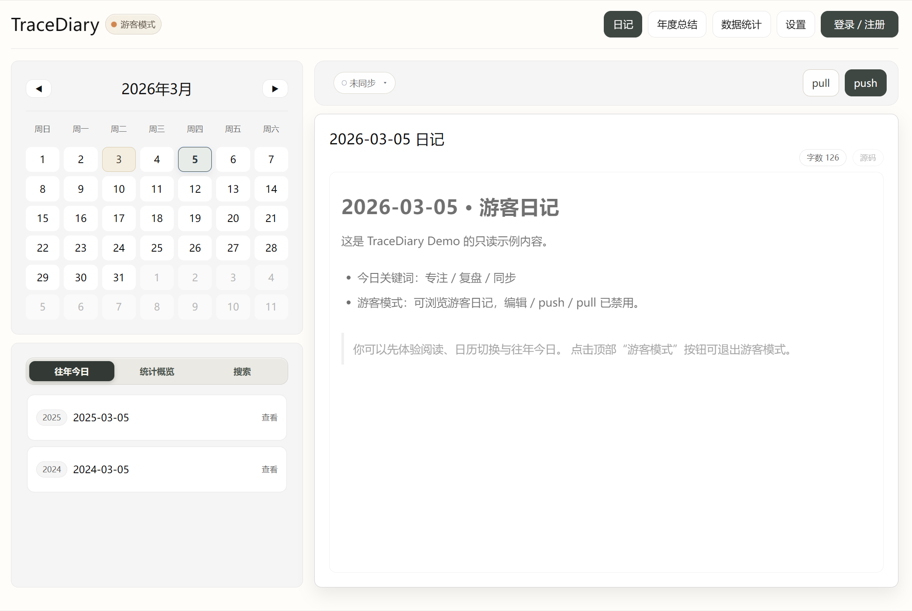
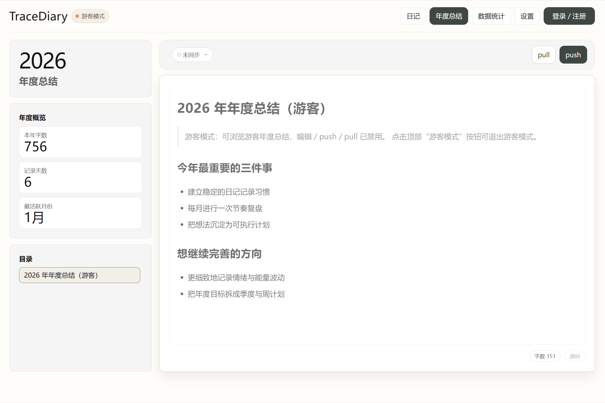
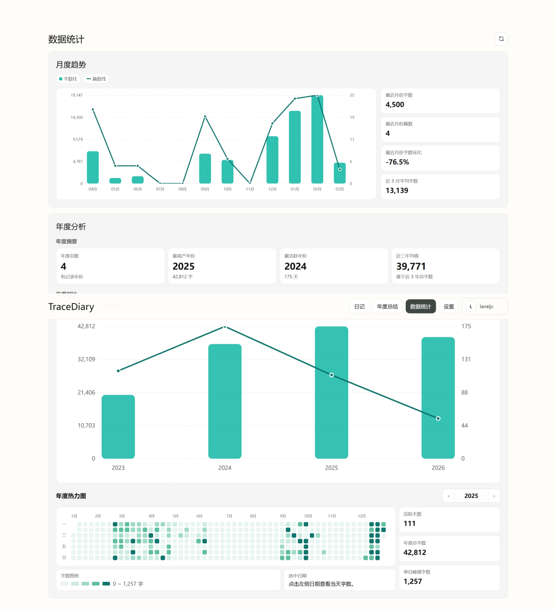

# TraceDiary

<p align="center">
  
</p>

<hr />

<p align="center">
  隐私优先的加密 Web 日记，支持 Git 仓库同步、年度回顾与数据统计
</p>

<p align="center">
  <a href="https://github.com/Lane0218/TraceDiary/blob/main/LICENSE">
    
  </a>
  <a href="https://github.com/Lane0218/TraceDiary/stargazers">
    
  </a>
  <a href="https://github.com/Lane0218/TraceDiary">
    
  </a>
  <a href="https://github.com/Lane0218/TraceDiary/commits/main">
    
  </a>
</p>

TraceDiary 是一个隐私优先的 Web 日记应用，采用“前端加密 + Gitee 私有仓库同步”架构。应用可在浏览器直接使用，支持跨设备访问，适合长期记录日常、整理年度回顾，并通过可视化页面观察自己的写作与使用趋势。

## 截图

### 日记页

用于每天记录内容，并快速查看当天与历史条目。



### 年度总结页

按年份聚合信息，方便做阶段复盘和年度回顾。



### 数据统计页

用可视化方式展示记录趋势和使用情况。



## 功能特性

- 前端 AES-256-GCM 加密，明文不上传远端
- Markdown 日记与年度总结编辑
- 手动 Push / Pull 同步到 Gitee 私有仓库
- 往年今日回顾与日历导航
- 数据统计与使用趋势可视化
- PWA 安装支持（移动端可用）

## 本地开发

### 环境要求

- Node.js 20+
- npm 10+
- 可选：Supabase（用于登录注册与云端配置同步）

### 环境变量

复制 `.env.example` 为 `.env`，按需填写：

```bash
cp .env.example .env
```

- `VITE_SUPABASE_URL`：Supabase 项目 URL
- `VITE_SUPABASE_ANON_KEY`：Supabase `anon` 公钥（禁止使用 `service_role`）

### 常用命令

本地开发：

```bash
npm install
npm run dev
```

默认开发地址：`http://localhost:5173`

构建与测试：

```bash
npm run build
npm run preview
npm run lint
npm run test:unit
npm run test:integration
npm run test:e2e:fast
```

## 部署

### Vercel 部署基线

1. 将仓库连接到 Vercel。
2. 构建命令设置为 `npm run build`。
3. 输出目录设置为 `dist`。
4. 配置生产环境变量（如 `VITE_GITEE_API_BASE`）。
5. 绑定自定义域名并确认 HTTPS 生效。

> 若启用 Supabase 登录，请确认 `vercel.json` 的 CSP `connect-src` 已放行 `https://*.supabase.co` 与 `wss://*.supabase.co`。

### 一键生产部署

仓库已提供一键生产部署脚本：`scripts/deploy-vercel-prod.sh`。

```bash
# 方式 A：临时环境变量
export VERCEL_TOKEN='你的新token'
bash scripts/deploy-vercel-prod.sh

# 方式 B：写入项目根目录 .env.local（脚本会自动读取）
# VERCEL_TOKEN=你的新token
bash scripts/deploy-vercel-prod.sh
```

> token 读取优先级：当前 shell 环境变量 `VERCEL_TOKEN` > 项目根目录 `.env.local`。

默认行为：

1. 校验 Vercel 身份
2. 执行 `npm run lint`
3. 执行 `vercel --prod` 生产部署
4. 校验 `https://diary.laneljc.cn` 与 `https://tracediary.laneljc.cn` 可达

常用参数：

```bash
# 自定义 scope
bash scripts/deploy-vercel-prod.sh --scope lanes-projects-29cb0384

# 自定义校验地址（可重复 --url）
bash scripts/deploy-vercel-prod.sh --url https://diary.laneljc.cn --url https://tracediary.laneljc.cn

# 仅部署，不做 lint/验收（紧急场景）
bash scripts/deploy-vercel-prod.sh --skip-lint --skip-verify
```

## 文档

- 详细产品与技术约束：`SPEC.md`
- 测试策略：`docs/testing-strategy.md`
- 兼容性记录：`docs/compatibility-report.md`

## License

MIT License，详见 `LICENSE`。
